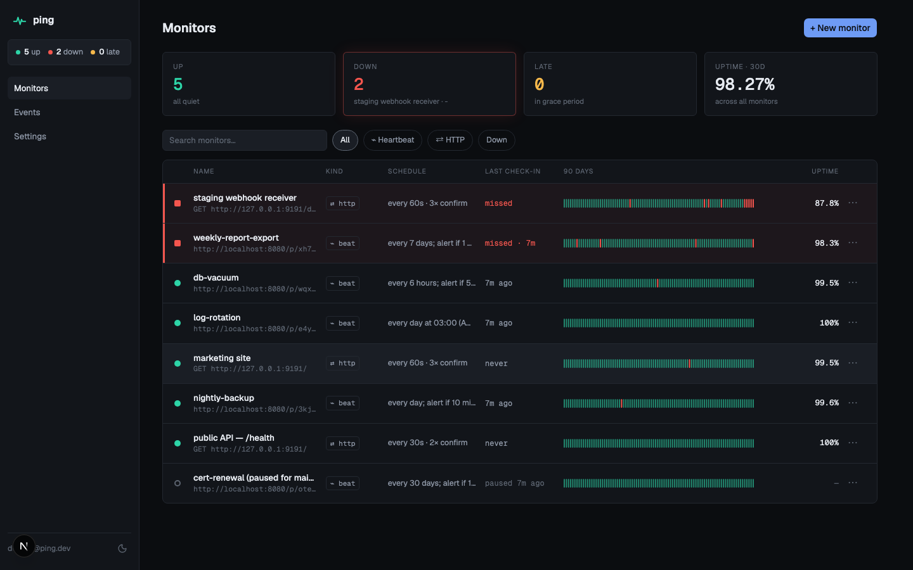
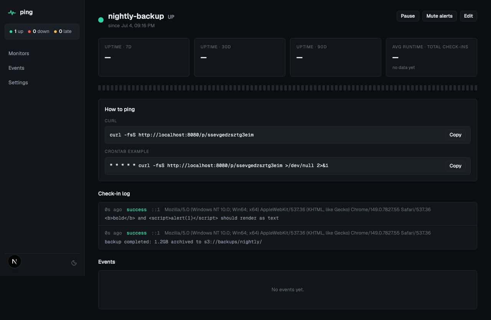

<div align="center">

# ⌁ ping

**Know when it didn't run.**

A self-hostable cron-job + uptime monitor. Your jobs hit a unique URL when they
finish — if a check-in doesn't arrive on time, you get an email. External sites
get active HTTP probes with latency tracking and TLS-expiry warnings.

[](LICENSE)
[](backend/go.mod)
[](frontend/package.json)
[](frontend/tsconfig.json)
[](frontend/e2e)
[](CONTRIBUTING.md)

</div>

---

## Screenshots

| Dashboard | Monitor detail |
|:---:|:---:|
|  |  |

Alert emails are plain and scannable: [down](docs/screenshots/alert-email-down.png) ·
[recovered](docs/screenshots/alert-email-up.png) ·
[TLS expiry](docs/screenshots/alert-email-tls.png) ·
[reminder](docs/screenshots/alert-email-reminder.png)

## Why ping

Cron jobs fail silently — the backup that didn't run looks exactly like the backup
that did, until you need it. ping is a dead-man's switch: the job proves it ran by
hitting its ping URL, and *silence* triggers the alert. Most uptime monitors only
probe from the outside; ping does both in one small app you can run on a $6 VPS.

- **Heartbeat monitors** — add one `curl` line to any cron job. Simple periods
  ("every 15 minutes") or cron expressions with real timezone/DST handling, plus a
  grace period before alerting. `/start` and `/fail` endpoints measure runtime and
  signal explicit failure; `/p/<slug>/$?` reports your exit code directly.
- **HTTP monitors** — probe any URL on an interval: status assertions, keyword
  match, latency recording, redirect control, custom headers. Alerts only after N
  consecutive failures (no 3 a.m. flap emails), plus TLS certificate expiry warnings.
- **Email alerts that can't be lost** — state transition + event + alert are written
  in one database transaction (a transactional outbox), so a crash can't drop or
  duplicate an alert. Recovery emails include the downtime duration.
- **Calm dashboard** — problems sort to the top, 90-day uptime bars per monitor,
  latency charts, a global event feed, dark-first design.
- **Automation-ready** — full REST API with API keys ([docs/API.md](docs/API.md),
  [openapi.yaml](openapi.yaml)).
- **Self-contained** — one Go binary (API + workers), Postgres, Redis, and a
  Next.js frontend. No timers held in memory: workers claim due work from Postgres
  with `FOR UPDATE SKIP LOCKED`, so restarts never lose a deadline.

## Tech stack

| Layer | Technology |
|---|---|
| Backend | Go 1.26, [chi](https://github.com/go-chi/chi), [pgx](https://github.com/jackc/pgx) + [sqlc](https://sqlc.dev), [golang-migrate](https://github.com/golang-migrate/migrate) |
| Storage | PostgreSQL 16 (source of truth), Redis 7 (rate limits + cache — app degrades gracefully without it) |
| Frontend | Next.js 16 (App Router), TypeScript, Tailwind v4, [shadcn/ui](https://ui.shadcn.com), TanStack Query |
| Auth | JWT RS256 — short-lived access token, rotating httpOnly refresh cookie; hashed API keys |
| Testing | `go test -race`, integration suite against real Postgres/Redis, Playwright E2E with a build-tagged test clock |

## Quick start

**Prerequisites:** Go 1.26+, Node 20+, Docker, `make`.

```bash
# 1. Clone and configure
git clone https://github.com/sukhera/ping.git && cd ping
cp .env.example .env

# 2. Generate JWT signing keys
mkdir -p backend/keys
openssl genrsa -out backend/keys/jwt_private.pem 2048
openssl rsa -in backend/keys/jwt_private.pem -pubout -out backend/keys/jwt_public.pem

# 3. Install pinned dev tools + git hooks
make tools && make hooks

# 4. Start infrastructure, migrate, run
make docker-up
make migrate-up
make dev                        # API + workers on :8080 (live reload)
cd frontend && npm ci && npm run dev   # frontend on :3000
```

Open http://localhost:3000, register (first user), create a heartbeat monitor, and
wire it into a cron job:

```cron
0 4 * * * /usr/local/bin/backup.sh && curl -fsS http://localhost:8080/p/<your-slug>
```

If the backup doesn't check in by 04:00-plus-grace, you get an email. That's the
whole product.

> **Production notes:** set `PING_ENV=production` (enables HSTS), point
> `PING_BASE_URL` at your public domain, close registration after signing up
> (`REGISTRATION_OPEN=false`), and configure real SMTP. `docker-compose.prod.yml`
> ships the full stack; terminate TLS at your proxy.

## How it works

```
your cron job ──▶ GET /p/<slug> ──▶ API ──▶ Postgres (check-in + next deadline)
                                              ▲
                 scheduler (15s tick) ────────┘ claims overdue monitors FOR UPDATE
                    │                           SKIP LOCKED; up→late→down + event
                    └─▶ alert outbox row        + alert row in ONE transaction
                          │
                 alerter (5s tick) ──▶ SMTP ──▶ your inbox (retries w/ backoff)

                 prober (5s tick) ──▶ HTTP targets (SSRF-guarded, bounded pool)
```

Deadlines live in the database, not in memory — a crash or deploy between ticks
loses nothing, and N replicas never double-alert. The full design, including why
the scheduler can't miss and the SSRF dial-time guard, is in
[docs/ARCHITECTURE.md](docs/ARCHITECTURE.md).

```
backend/
├── cmd/ping/       # single binary; --role api|worker|all
├── server/         # HTTP handlers, middleware, auth
├── store/          # business logic (server → store → db, nothing imports server)
├── schedule/       # pure cron/period/grace math — zero I/O, DST-tested
├── worker/         # scheduler, prober, alerter, rollup loops
├── alert/          # channel abstraction + SMTP email
└── db/             # migrations, sqlc queries + generated code
frontend/
├── app/            # App Router pages
├── components/     # ui/ (shadcn, retokened) + app/ (StatusChip, UptimeBar, …)
└── e2e/            # Playwright suites
```

## Documentation

| Doc | Contents |
|---|---|
| [docs/API.md](docs/API.md) | REST API reference — endpoints, auth, errors, rate limits |
| [docs/ARCHITECTURE.md](docs/ARCHITECTURE.md) | System design, scheduler guarantees, data model |
| [docs/DEVELOPMENT.md](docs/DEVELOPMENT.md) | Make targets, migrations, sqlc, testing, time-warp E2E |
| [openapi.yaml](openapi.yaml) | Machine-readable OpenAPI 3.1 spec |
| [PRD.md](PRD.md) · [TECH-PLAN.md](TECH-PLAN.md) · [DESIGN.md](DESIGN.md) | How this was specced, planned, and designed |

## Testing

```bash
make verify              # full local gate: fmt, vet, lint, race tests, type-check, drift
make test-integration    # against real Postgres + Redis (needs docker-up)
cd frontend && npm run e2e   # Playwright; uses a build-tagged clock to time-warp deadlines
```

The E2E suite covers the paths that matter: register → create monitor → ping →
watch it go down when the deadline passes (clock-warped, not slept) → recover.
The test clock endpoint is compiled out of production builds.

## Configuration

Everything is environment variables, documented in [`.env.example`](.env.example).
The server refuses to start if required config is missing. Never commit `.env` or
`backend/keys/` — the pre-commit hook runs gitleaks to make sure.

## Contributing

See [CONTRIBUTING.md](CONTRIBUTING.md) — trunk-based, Conventional Commits
(hook-enforced), `make verify` before every push. The ticket history in
[TECH-PLAN.md §8](TECH-PLAN.md) shows how the project was built.

## License

[MIT](LICENSE) © 2026 Ahmed Sukhera
