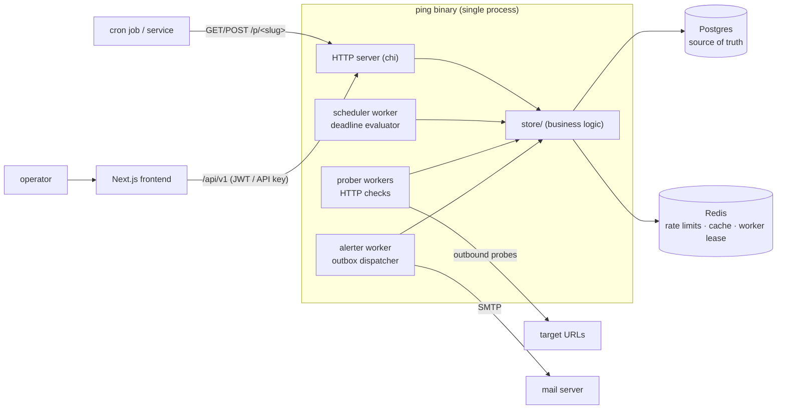
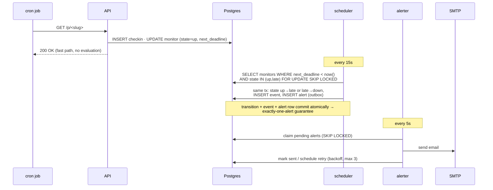
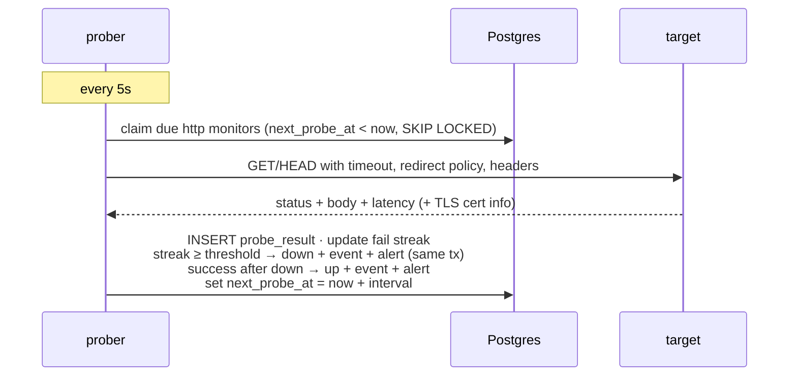
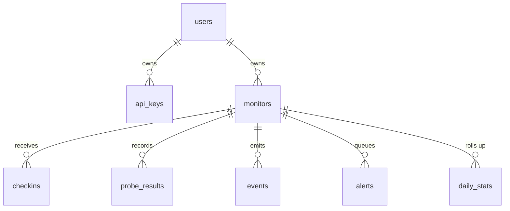

# ping — Technical Implementation Plan

**Version:** 1.0 · **Date:** 2026-07-01 · Companions: `PRD.md` (what) · `DESIGN.md` (look & feel) · this doc (how)

---

## 1. Summary

One Go binary (API + background workers) + Postgres + Redis + a Next.js frontend — the shrt architecture extended with a worker runtime. Everything below follows the conventions already encoded in the `golang-backend-specialist`, `database-specialist`, and `security-specialist` skills, so agent-assigned tickets inherit the same rules.

**Stack:** Go 1.26 · chi · pgx + sqlc · golang-migrate · Redis 7 · Postgres 16 · Next.js 16 (App Router) · TypeScript · Tailwind v4 · shadcn/ui (retokened per `DESIGN.md`) · TanStack Query · Playwright.

## 2. System architecture



Design rules:

- **Single process, multiple loops.** API and workers ship in one binary, started from `cmd/ping/main.go` via `errgroup` with shared graceful shutdown. A `--role=api|worker|all` flag (default `all`) allows splitting later without a rewrite — extensibility without premature microservices.
- **Postgres is the source of truth** for all state, deadlines, and alert delivery status. Redis is ephemeral: rate limits, dashboard cache, and a worker lease (so N replicas don't double-evaluate). The app must run correctly (degraded, uncached) if Redis is down — cache failures never block, per the database-specialist skill.
- **Workers are DB-driven, not timer-driven.** No in-memory `time.AfterFunc` per monitor. Each loop wakes on an interval and claims due work from Postgres with `FOR UPDATE SKIP LOCKED`. Restart-safe, crash-safe, horizontally safe.

### 2.1 Heartbeat flow (ingest + down detection)



### 2.2 HTTP probe flow



Prober details: bounded worker pool (`errgroup.SetLimit`, default 16 concurrent probes); per-probe `context` deadline = configured timeout; body read capped (64 KB) for keyword matching; response bodies never stored, only match result + status + latency; SSRF guard resolves DNS and rejects private/loopback/link-local/metadata ranges *at dial time* (custom `DialContext`), not just at config time — re-resolution attacks covered.

### 2.3 Data model



| Table | Key columns (beyond `id`, timestamps) |
|---|---|
| `users` | `email` (UK), `password_hash` |
| `api_keys` | `user_id` FK, `key_hash` (UK — plaintext never stored), `label`, `last_used_at`, `revoked_at` |
| `monitors` | `user_id` FK, `kind` (`heartbeat\|http`), `slug` (UK), `name`, schedule: `schedule_kind` (`period\|cron`), `period_s`, `cron_expr`, `tz`, `grace_s`; http: `url`, `method`, `interval_s`, `timeout_s`, `fail_threshold`, `http_config` JSONB (headers, keyword, redirects); runtime: `state` (`new\|up\|late\|down` — see paused note below), `fail_streak`, `last_checkin_at`, `next_deadline`, `next_probe_at`, `alerts_muted`, `paused_at` |
| `checkins` | `monitor_id` FK, `kind` (`success\|start\|fail`), `source_ip` INET, `user_agent`, `body` (≤ 10 KB) — BIGSERIAL PK, append-only |
| `probe_results` | `monitor_id` FK, `ok`, `http_status`, `latency_ms`, `error`, `tls_expires_at` — BIGSERIAL, append-only |
| `events` | `monitor_id` FK, `type`, `message`, `meta` JSONB — BIGSERIAL, immutable |
| `alerts` | `monitor_id` FK, `event_id` FK, `channel` (`email`, extensible), `status` (`pending\|sent\|failed`), `attempts`, `next_attempt_at`, `sent_at` — the outbox |
| `daily_stats` | `(monitor_id, day)` PK, `checkins`, `failures`, `downtime_s`, `latency_p50`, `latency_p95` |

Schema conventions (database-specialist skill): `TIMESTAMPTZ` everywhere; `NOT NULL` + `CHECK` constraints at the DB level (`kind`, `state`, `schedule_kind` as constrained TEXT — cheaper to extend than enums); FKs with explicit `ON DELETE CASCADE`; `BIGSERIAL` PKs for high-volume append tables (`checkins`, `probe_results`, `events`, `alerts`), UUIDs for entities.

**Paused is a flag, not a state.** `state` holds only the evaluation lifecycle — the CHECK constraint allows exactly `new|up|late|down`. Pausing sets `paused_at` and leaves `state` untouched: resume restores the prior state with zero bookkeeping, check-in history and uptime stay coherent (PRD F1.6), and the UI renders "paused 3d ago" straight from the timestamp. The user-facing `paused` state in PRD §5 is derived (`paused_at IS NOT NULL → paused`, else `state`) — the API returns both the derived display state and the raw fields. This is also why both predicates in `idx_monitors_due` are necessary rather than redundant: `paused_at IS NULL` excludes paused monitors, `state IN ('up','late')` excludes `new` (never alerts) and `down` (already down). Resume semantics: manual resume re-arms `next_deadline` from the resume moment (never the stale pre-pause deadline); auto-resume-on-ping re-arms from the incoming check-in.

Critical indexes:

```sql
CREATE INDEX idx_monitors_due       ON monitors (next_deadline) WHERE state IN ('up','late') AND paused_at IS NULL;
CREATE INDEX idx_monitors_probe_due ON monitors (next_probe_at) WHERE kind = 'http' AND paused_at IS NULL;
CREATE INDEX idx_alerts_pending     ON alerts (next_attempt_at) WHERE status = 'pending';
CREATE INDEX idx_checkins_monitor   ON checkins (monitor_id, created_at DESC);
CREATE INDEX idx_probe_results_mon  ON probe_results (monitor_id, created_at DESC);
CREATE INDEX idx_events_monitor     ON events (monitor_id, created_at DESC);
```

Partial indexes keep the three worker scans index-only and tiny regardless of history size. List endpoints use cursor pagination (`WHERE id < $cursor LIMIT n`) — never OFFSET.

### 2.4 The `schedule` package (pure core)

All cron/period/grace math lives in `backend/schedule/` with **zero I/O**: `NextDeadline(cfg, lastCheckin, now)`, `Describe(cfg) string` (powers the form's live preview via API), DST-aware via `time.LoadLocation`. Cron parsing via `robfig/cron/v3` (5-field, standard). This package gets the heaviest table-driven test suite in the repo (DST spring-forward/fall-back, month boundaries, TZ vs server clock). Pure function core → trivially testable, reusable by both scheduler and API validation.

## 3. Extensibility (designed-in, not built)

| Future feature | v1 seam that enables it |
|---|---|
| Slack / webhook / SMS alerts | `alert.Channel` interface (`Send(ctx, Notification) error`) + `alerts.channel` column. Email is implementation #1; a new channel = one file + one enum value. |
| New check kinds (TCP, DNS, ICMP) | `monitors.kind` + `http_config JSONB` pattern; prober dispatches on kind via a `Probe(ctx, Monitor) Result` interface. |
| Status pages | `events` + `daily_stats` are already the public-page data source; add a read-only handler + page. No schema change. |
| Teams / multi-tenant | Every table already hangs off `user_id`; introduce `org_id` via expand-migrate-contract later. Don't build roles now. |
| Horizontal scale | `--role` flag + `SKIP LOCKED` claiming + Redis lease already make N workers safe. |
| Prometheus metrics | Instrument workers with counters from day one behind an internal `metrics` package (no-op impl in v1; `/metrics` handler is a v2 ticket). |

Rule of thumb: **add seams (interfaces, columns, flags), never speculative features.**

## 4. Repository layout

```
ping/
├── .github/
│   ├── ISSUE_TEMPLATE/ticket.yml         # matches §8 ticket format
│   ├── PULL_REQUEST_TEMPLATE.md          # checklist from §7.3
│   └── workflows/ci.yml                  # written + committed now, runs when billing returns
├── backend/
│   ├── cmd/ping/main.go                  # wiring + errgroup only; no logic
│   ├── server/                           # HTTP: router, handlers, middleware, responses
│   │   ├── server.go  middleware.go  response.go  context.go
│   │   ├── auth.go  monitor.go  ping.go  event.go  apikey.go  health.go
│   │   └── *_test.go
│   ├── store/                            # business logic (no service layer — shrt pattern)
│   │   ├── store.go  errors.go  convert.go
│   │   ├── monitor.go  checkin.go  event.go  alert.go  user.go  apikey.go
│   │   ├── ratelimit.go  slug.go
│   │   └── *_test.go
│   ├── schedule/                         # pure cron/period/grace math — zero I/O
│   ├── worker/
│   │   ├── worker.go                     # lifecycle, lease, tick loop helper
│   │   ├── scheduler/  prober/  alerter/
│   ├── alert/                            # Channel interface + email/ impl + templates
│   ├── internal/config/                  # env loading — the only place os.Getenv appears
│   ├── db/
│   │   ├── migrations/                   # golang-migrate, up+down, immutable once merged
│   │   ├── queries/                      # sqlc inputs (*.sql)
│   │   └── *.go                          # sqlc output — generated, committed, never hand-edited
│   ├── keys/                             # JWT RSA keys — gitignored
│   ├── Dockerfile  sqlc.yaml  .golangci.yml  .air.toml
├── frontend/
│   ├── app/                              # (auth)/login,register · dashboard · monitors/[id] · monitors/new · events · settings
│   ├── components/ui/                    # shadcn — generated, then retokened
│   ├── components/app/                   # status-chip, uptime-bar, sparkline, monitor-row, stat-block, schedule-preview…
│   ├── hooks/  lib/  providers/  types/  e2e/
│   └── (config files as in shrt)
├── docs/
│   ├── ARCHITECTURE.md  API.md  DEVELOPMENT.md  README.md (index)
│   └── screenshots/
├── PRD.md  DESIGN.md  TECH-PLAN.md
├── Makefile  lefthook.yml  docker-compose.yml  docker-compose.prod.yml
├── .env.example  .gitignore  openapi.yaml  README.md  LICENSE  CONTRIBUTING.md
├── CLAUDE.md  AGENTS.md                  # agent instructions: point at skills, Makefile gates, this doc
```

Package dependency direction (enforced by review): `server → store → db`; `worker/* → store, schedule, alert`; `schedule` and `alert` import nothing internal except `db` types. Nothing imports `server`.

## 5. Engineering standards

The three skill files are the law; this section only pins project-specific decisions.

**Go** — chi + stdlib `net/http` with all four server timeouts set; `log/slog` JSON in prod, text in dev, request-ID middleware; errors wrapped `fmt.Errorf("op: %w", err)`, matched with `errors.Is/As`; store returns sentinel errors (`ErrNotFound`, `ErrSlugTaken`…), server maps them to HTTP once in `response.go`; every handler and worker claim uses a context deadline — `context.Background()` only in `main.go`; `crypto/rand` for slugs and API keys (never `math/rand`); table-driven tests + `-race` always; integration tests behind `//go:build integration`.

**Database** — migrations immutable once merged, always up+down, both tested; sqlc queries in `db/queries/*.sql`, regenerate via `make sqlc`, generated output committed and verified clean by the gate (§7.4); `pgtype` for nullables; app connects as a non-superuser role.

**Frontend** — App Router with server components by default, client components only where interactive; TanStack Query for all API state (no useEffect fetching); `lib/api.ts` is the single typed fetch wrapper (auth refresh logic lives there, ported from shrt); design tokens from `DESIGN.md` §4–5 are the *only* colors — raw hex in a component is a review-blocker; status rendered exclusively through the shared `<StatusChip>`; tabular-nums mono for all numerics.

**Security** (per security-specialist skill) — JWT RS256, access token in memory / refresh in httpOnly cookie; bcrypt cost ≥ 12; API keys stored hashed (SHA-256), shown once; per-IP rate limit on `/p/*` (generous) and auth endpoints (tight), Redis INCR+EXPIRE, fail-open on Redis outage; SSRF dial-time guard (§2.2); check-in bodies rendered escaped only; security headers middleware (CSP, HSTS in prod, nosniff, frame-deny); no internal error details in responses; gitleaks in the pre-commit gate.

## 6. Git & GitHub practices

### 6.1 Branching & commits

- **Trunk-based:** `main` is always releasable; short-lived branches `<ticket>-<slug>`, e.g. `ping-009-scheduler-worker`. No `develop`, no release branches — tags mark releases (`v1.0.0`, SemVer).
- **Conventional Commits**, enforced by the commit-msg hook:
  `type(scope): summary` — types `feat fix docs test refactor perf build chore`; scopes `server store worker db schedule alert fe docs infra`. Body explains *why*; footer `Refs: PING-009`.
  - `feat(worker): claim due monitors with SKIP LOCKED`
  - `fix(schedule): handle DST fall-back for cron deadlines`
- Squash-merge PRs; the squash title must itself be a valid conventional commit (it becomes changelog input).

### 6.2 What is committed vs. not

| ✅ Committed | ❌ Never committed (`.gitignore`) |
|---|---|
| sqlc-generated `db/*.go` (reviewable, no codegen on clone) | `.env`, any real secrets |
| `package-lock.json`, `go.sum` | `backend/keys/` (JWT RSA pair) |
| Migrations (immutable) | `node_modules/`, `.next/`, `dist/`, `backend/bin/`, `tmp/` |
| `openapi.yaml`, `.env.example` (placeholder values only) | coverage output, `*.test`, profiles |
| `lefthook.yml`, `.golangci.yml`, editor-agnostic config | `.DS_Store`, `.idea/`, `.vscode/` (personal) |
| `docs/screenshots/*.png` (optimized, < 300 KB each) | local scratch (`*.local.*`, `scratch/`) |
| `.github/workflows/ci.yml` (ready for when billing returns) | database dumps, `*.sql` backups |

Policy for generated code: committed **and** gate-verified — `make sqlc && git diff --exit-code db/` runs in pre-push, so drift between queries and generated code cannot land.

### 6.3 PR checklist (`PULL_REQUEST_TEMPLATE.md`)

```markdown
## What & why
Refs: PING-XXX

## Checklist
- [ ] `make verify` passes locally (paste the summary line)
- [ ] New/changed behavior covered by tests (unit; integration if it touches DB/workers)
- [ ] Migrations: up AND down tested (`make migrate-up && make migrate-down && make migrate-up`)
- [ ] No new colors/typography outside DESIGN.md tokens (frontend PRs)
- [ ] Docs updated (API.md / ARCHITECTURE.md / .env.example) if behavior or config changed
- [ ] Screenshots attached for UI changes (dark theme)
```

### 6.4 Quality gates with CI down (the real gate)

Since GitHub Actions is unavailable, **the machine-enforced gate moves local** via [lefthook](https://github.com/evilmartians/lefthook) (single tool for the Go + TS monorepo). `make hooks` installs it; `CONTRIBUTING.md` states that `--no-verify` pushes are treated as broken builds and reverted.

```yaml
# lefthook.yml
commit-msg:
  commands:
    conventional:
      run: |
        grep -qE '^(feat|fix|docs|test|refactor|perf|build|chore)(\([a-z]+\))?!?: .{1,72}' {1} \
          || (echo "✗ not a conventional commit"; exit 1)

pre-commit:
  parallel: true
  commands:
    gitleaks:      { run: gitleaks protect --staged --redact }
    go-fmt:        { glob: "*.go", run: gofmt -l {staged_files} | tee /dev/stderr | wc -l | grep -q '^0$' }
    go-lint-fast:  { glob: "backend/**/*.go", run: cd backend && golangci-lint run --fast ./... }
    fe-lint:       { glob: "frontend/**/*.{ts,tsx}", run: cd frontend && npx eslint {staged_files} }

pre-push:
  commands:
    verify: { run: make verify }
```

```make
# Makefile (gate targets)
verify: verify-backend verify-frontend verify-generated          ## the full local gate ≈ CI
verify-backend:
	cd backend && gofmt -l . | (! grep .) && go vet ./... \
	  && golangci-lint run ./... && go test -race ./... \
	  && go mod tidy && git diff --exit-code go.mod go.sum
verify-frontend:
	cd frontend && npm run type-check && npm run lint && npm run test
verify-generated:
	make sqlc && git diff --exit-code backend/db
test-integration:                                                ## needs docker-up
	cd backend && go test -race -tags integration ./...
```

Target: pre-commit < 10s (staged-only, `--fast` lint), pre-push < 3 min. Integration + E2E are not in the hook (too slow) but are **required by the PR checklist** for tickets touching DB/workers/UI flows. With Actions billing restored, CI is the second enforcement point — its design lives in §6.6, and hooks remain the first line so feedback stays local and instant.

### 6.5 Labels & milestones (GitHub)

Labels: `m0-foundation` `m1-heartbeat` `m2-alerts-dashboard` `m3-http` `m4-ship` · `backend` `frontend` `db` `infra` `docs` · `feature` `chore` · `size:S` `size:M` `size:L`. Milestones M0–M4 map to PRD §11.

Creating the tickets below as issues:

```bash
# one-off: create labels, then loop over tickets (title = "PING-XXX: <title>")
gh label create m1-heartbeat --color 2DD4A7 ... 
gh issue create --title "PING-009: Scheduler worker — deadline evaluation" \
  --label m1-heartbeat,backend,feature,size:L --milestone M1 \
  --body "$(sed -n '/### PING-009/,/^### PING-010/p' TECH-PLAN.md)"
```

(Each ticket section below is self-contained precisely so it can be pasted/extracted into an issue body and handed to an agent.)

### 6.6 GitHub Actions design (billing restored)

The v1 monolithic `ci.yml` (one serial job: compile three tools from source, install browsers, run everything) is the anti-pattern that makes CI slow AND flaky — `@latest` tool installs drift from local versions, and a 20-minute wall time turns every red build into a half-hour agent debug loop. The redesign (implemented by PING-025):

**Budgets, treated as SLOs:** PR feedback (lint + unit) < 5 min p50; full pipeline < 10 min. A breach is an `infra` bug ticket, not a fact of life.

**Split into parallel jobs gated by change detection** (`dorny/paths-filter` as a first `changes` job):

| Job | Runs when | Contents | Timeout |
|---|---|---|---|
| `backend` | `backend/**` or `Makefile` changed, and always on `main` | `make verify-backend` + `verify-generated` | 10 min |
| `frontend` | `frontend/**` changed, and always on `main` | `make verify-frontend` | 10 min |
| `integration` | `backend/**` changed | Postgres+Redis services, `make migrate-up` + `test-integration` | 10 min |
| `e2e` | `frontend/**` or `backend/server\|store\|worker/**` changed, and always on `main` | Playwright suite | 15 min |

`make verify` stays the local command; CI calls the per-area targets directly so a docs-only PR runs almost nothing and a backend PR never waits on Playwright.

**Tooling rules — the flakiness killers:**
- Never `go install <tool>@latest` in CI: it compiles from source (minutes) and un-pins the version so CI and local hooks disagree. golangci-lint via its official action (pinned version, built-in cache); sqlc + migrate as pinned prebuilt release binaries, versions declared in one place (`Makefile` vars) so local and CI can't drift.
- Cache all the things: setup-go/setup-node built-in caches (already in place), golangci-lint action cache, Playwright browsers cached keyed on the `@playwright/test` version — `--with-deps` reinstall on every run is multiple minutes of pure waste.
- Pin action majors (`actions/checkout@v4`), `timeout-minutes` on every job (a hung job otherwise burns the 6-hour default), and workflow-level `concurrency: { group: ci-${{ github.ref }}, cancel-in-progress: true }` so a force-push cancels the stale run instead of queueing behind it.

**Branch protection:** require the four job checks on `main` (skipped-by-filter counts as success). Hooks remain the first gate — CI catches what slipped, it is not the debugging environment.

**CI-failure discipline (for agents and humans):** reproduce locally first — `make verify` mirrors CI by construction, and integration failures reproduce with `make docker-up && make test-integration`. Fetch logs once with `gh run view --log-failed`, fix locally, push once. Push-to-debug cycles are the single biggest time-and-token sink an agent can fall into; a session that pushes more than twice for the same red check should stop and reproduce locally instead.

## 7. Documentation set

`README.md` mirrors shrt's structure (it works): centered header + one-line pitch + badges → screenshots (dark) → features → tech stack table → quick start (≤ 5 commands) → architecture summary + tree → docs table → testing → configuration → contributing → license. Written in PING-024, screenshot-driven.

`docs/ARCHITECTURE.md` gets the §2 diagrams plus a dedicated **"Why the scheduler can't miss"** section (deadlines in Postgres, SKIP LOCKED, outbox) — it's the most interview-valuable part of the project. `docs/API.md` + `openapi.yaml` cover the REST surface, including the unauthenticated ping endpoints. `docs/DEVELOPMENT.md` covers make targets, hooks, migrations, sqlc, time-warp testing. `CLAUDE.md`/`AGENTS.md` at root point agents to the skills, the gate (`make verify`), and the ticket format.

---

## 8. Tickets

> Format per ticket: goal, key implementation notes, acceptance criteria (AC). Deps = must merge first. All tickets implicitly include: tests per §5, `make verify` green, docs touched if behavior/config changed.

### M0 — Foundation

### PING-001: Repo scaffolding, Makefile, compose, hooks, CI-ready workflow
`m0` `infra` `chore` `size:M` · Deps: —

Monorepo skeleton per §4: Makefile (`dev`, `verify`, `hooks`, `sqlc`, `migrate-*`, `docker-*`), docker-compose (Postgres 16 + Redis 7), `.env.example`, `.gitignore` per §6.2, lefthook config per §6.4, issue/PR templates, `ci.yml` (present, will activate with billing), LICENSE, CONTRIBUTING.md, root CLAUDE.md/AGENTS.md.

**AC**
- [ ] Fresh clone: `make hooks && make docker-up` works; `make verify` passes on the empty skeleton
- [ ] Commit with message `bad message` is rejected; staged fake secret is caught by gitleaks
- [ ] `.env` and `backend/keys/` are ignored; `git status` clean after `make dev`
- [ ] PR + issue templates render correctly on GitHub

### PING-002: Database schema v1 + sqlc setup
`m0` `db` `feature` `size:M` · Deps: PING-001

All tables, constraints, and indexes from §2.3 as golang-migrate migrations (up+down each); sqlc configured; initial query files for users/monitors/api_keys.

**AC**
- [ ] `make migrate-up && make migrate-down && make migrate-up` clean on empty DB
- [ ] All §2.3 CHECK constraints reject bad values (test: insert invalid `kind`/`state`)
- [ ] Partial indexes verified used via `EXPLAIN` on the three worker scan queries (documented in PR)
- [ ] `make sqlc` output committed; `verify-generated` passes

### PING-003: Config, server skeleton, middleware, /health
`m0` `backend` `feature` `size:M` · Deps: PING-002

`internal/config` (fail-fast validation, all env in `.env.example`); chi server with timeouts; middleware chain: request-ID → slog logging → recover → security headers → CORS; `/health` checking DB + Redis + worker heartbeat timestamps (Redis keys, written by workers in later tickets); `response.go` error mapping.

**AC**
- [ ] Missing required env → process exits non-zero with a clear message naming the variable
- [ ] `/health` returns 200 with component statuses; 503 when Postgres is stopped
- [ ] All responses carry security headers; panics in a handler produce 500 JSON without stack trace, with request-ID logged
- [ ] Server shuts down gracefully on SIGTERM (in-flight request completes)

### PING-004: Auth — JWT RS256 + refresh rotation + registration lockdown
`m0` `backend` `feature` `size:M` · Deps: PING-003

Port shrt's auth (register/login/refresh/logout, RS256, httpOnly refresh cookie, rotation). Add `REGISTRATION_OPEN=false` gate (403 with clear message when closed). Tight rate limit on auth endpoints.

**AC**
- [ ] Full auth flow passes the ported shrt test suite (adapted)
- [ ] With `REGISTRATION_OPEN=false`, register returns 403; first-user bootstrap documented in DEVELOPMENT.md
- [ ] Refresh token reuse after rotation is rejected and revokes the family
- [ ] 6th login attempt within a minute from one IP → 429 with Retry-After

### PING-005: Frontend scaffold + design tokens + app shell
`m0` `frontend` `feature` `size:M` · Deps: PING-001 (parallel with 002–004)

Next.js 16 + Tailwind v4 + shadcn (New York), retokened to `DESIGN.md` §4–5 (dark-first, Geist Sans/Mono via `next/font`); app shell: sidebar (logo, global status summary placeholder, nav, footer), auth pages wired to PING-004, theme toggle, TanStack Query provider, typed `lib/api.ts` with refresh handling.

**AC**
- [ ] Token values in `globals.css` match DESIGN.md §4 exactly; no other color literals in the codebase (lint rule or grep check documented)
- [ ] Login → dashboard (empty) → logout works against the real backend
- [ ] Dark/light/system theme switching persists; dark is default
- [ ] Lighthouse ≥ 90 (performance + a11y) on the empty shell

### M1 — Heartbeat core

### PING-006: `schedule` package — period/cron/grace math
`m1` `backend` `feature` `size:M` · Deps: — (pure package; parallel-safe)

Pure functions: `NextDeadline`, `Describe` (human words for the form preview), validation. `robfig/cron/v3`, IANA TZ, DST-correct.

**AC**
- [ ] Table-driven tests: simple periods, cron across DST spring-forward and fall-back, month/year boundaries, TZ ≠ server TZ — ≥ 95% coverage on this package
- [ ] `Describe({cron:"0 4 * * *", tz:"Europe/Berlin", grace:1800})` → "every day at 04:00 (Europe/Berlin); alert if 30 min late"
- [ ] Invalid cron/TZ return typed errors the API maps to 422 with field-level detail
- [ ] Fuzz test on the cron parser wrapper does not panic

### PING-007: Monitor CRUD API
`m1` `backend` `feature` `size:M` · Deps: PING-002, 004, 006

`/api/v1/monitors` CRUD + validation (PRD F1.4, F2.1 fields), slug generation (`crypto/rand`, 16 chars), cursor pagination, ownership checks (403 on foreign monitor — not 404-masking, per security checklist), `POST /api/v1/schedule/describe` for the live preview.

**AC**
- [ ] CRUD round-trip with all schedule variants; invalid configs → 422 with field errors
- [ ] User B accessing user A's monitor → 403; unauthenticated → 401
- [ ] List pagination is cursor-based and stable under concurrent inserts
- [ ] Create returns the full ping URL; slug collision retries transparently

### PING-008: Ping ingestion endpoints
`m1` `backend` `feature` `size:L` · Deps: PING-007

`/p/<slug>`, `/start`, `/fail`, `/<exit-code>` per PRD F1.2–F1.3: GET/POST/HEAD, always tiny 200, body capture (10 KB cap, truncate not reject), source IP + UA, state→up + next_deadline recompute on success, immediate down on fail, paused auto-resume, generous per-IP rate limit. Ingest path does **no** alert evaluation (fast path).

**AC**
- [ ] p99 < 50ms under `hey -n 10000 -c 50` locally (documented in PR)
- [ ] `/fail` → state `down`, event recorded, alert row queued; next success → `up` (+ recovery alert row)
- [ ] Unknown slug → 200 (anti-enumeration, matching Healthchecks behavior) but nothing recorded — decision documented in API.md
- [ ] 15 KB body stored truncated at 10 KB; binary bodies don't break rendering (escaped)

### PING-009: Scheduler worker — deadline evaluation
`m1` `backend` `feature` `size:L` · Deps: PING-006, 008

The §2.1 loop: 15s tick, claim via `FOR UPDATE SKIP LOCKED` on the partial index, transitions up→late→down, event + alert outbox row in the same tx, worker heartbeat to Redis for `/health`, `worker/worker.go` lifecycle helper (tick, jitter, graceful stop) shared with prober/alerter.

**AC**
- [ ] Integration test: monitor with 1s period + 1s grace transitions up→late→down with correct events; exactly ONE down alert row exists after 10 ticks
- [ ] Two scheduler instances running concurrently: no duplicate transitions/alerts (SKIP LOCKED verified)
- [ ] Kill -9 during a tick, restart: no lost deadline, no duplicate alert
- [ ] `/health` reports scheduler last-tick; stale > 60s → 503

### PING-010: Events + pause/resume API
`m1` `backend` `feature` `size:S` · Deps: PING-009

Event feed endpoints (global + per-monitor, cursor pagination), pause/resume/mute endpoints, auto-resume on ping (configurable per monitor, default on), config-change events.

**AC**
- [ ] Pausing stops scheduler evaluation (no late/down while paused) but check-ins still record; `state` column is untouched by pause/resume (flag model per §2.3)
- [ ] Manual resume re-arms `next_deadline` from the resume moment — a monitor paused past its deadline does NOT go late/down immediately on resume (test case)
- [ ] Every state transition, pause/resume, mute, and config change appears in the feed with correct timestamps
- [ ] Global feed filterable by monitor and event type

### M2 — Alerts + dashboard

### PING-011: Alert channel abstraction + SMTP email
`m2` `backend` `feature` `size:M` · Deps: PING-003

`alert.Channel` interface + email implementation: SMTP client (TLS, auth), templates per PRD F3.2 (down with reason, up with duration, TLS expiry warning, reminder), `POST /api/v1/alerting/test` endpoint. Templates are plain-text-first with a minimal HTML variant using DESIGN.md tokens.

**AC**
- [ ] Emails render correctly in a local mailpit/mailhog (screenshots in PR); subjects match PRD F3.2 format
- [ ] Send failures return typed errors (retryable vs permanent — 5xx vs auth)
- [ ] "Send test email" delivers and reports SMTP errors back to the caller usefully
- [ ] No secrets (SMTP password) in logs at any level

### PING-012: Alerter worker — outbox dispatch
`m2` `backend` `feature` `size:M` · Deps: PING-009, 011

Claim pending alert rows (SKIP LOCKED, `next_attempt_at` ordering), send via channel, mark sent / backoff retry (1m→5m→25m, max 3, then `failed` + event), daily reminder scheduling for still-down monitors (per-monitor cadence config), respect mute.

**AC**
- [ ] SMTP down: alert retries on schedule, succeeds when SMTP returns, `attempts` correct; after 3 failures → `failed` + visible event
- [ ] Duplicate delivery impossible: crash after send but before mark → at-most-one duplicate documented as the accepted edge (and why), OR idempotency key used — decision recorded in ARCHITECTURE.md
- [ ] Muted monitor: transitions still recorded, no email sent, reminder suppressed
- [ ] Recovery email includes accurate downtime duration

### PING-013: Dashboard — monitor list
`m2` `frontend` `feature` `size:L` · Deps: PING-005, 007, 010

The DESIGN.md §7.1 screen: stat strip (big-numeral up/down/late/uptime), problem-first sorted rows (status shape+dot, name+slug, kind chip, schedule summary, relative last check-in, 90-day uptime bar as SVG, uptime %), search + kind/state filters in URL params, 30s polling, pulse animation on fresh check-in, empty/loading/error states, `down` row treatment.

**AC**
- [ ] Matches `design-mockup.html` visually (side-by-side screenshot in PR, dark theme)
- [ ] Sort order: down → late → new → up → paused, then name; updates live on poll
- [ ] Uptime bar renders 90 cells from `daily_stats` + today-so-far; per-day tooltip
- [ ] Status conveyed by shape + color + text (axe/a11y check passes); `prefers-reduced-motion` disables pulse
- [ ] Filters and search survive reload (URL state)

### PING-014: Monitor detail — heartbeat
`m2` `frontend` `feature` `size:M` · Deps: PING-013

DESIGN.md §7.2: header (status + since-when + pause/mute/edit), stat row, "How to ping" panel (curl + crontab snippets with copy buttons), check-in log with expandable escaped bodies, event feed, full-width uptime bar.

**AC**
- [ ] Copy buttons produce working commands containing the real slug URL
- [ ] Check-in bodies with HTML/script content render inert (escaped) — XSS test in e2e
- [ ] Pause/resume/mute act optimistically and reconcile with server state
- [ ] Uptime % for 7/30/90d matches `daily_stats` rollups

### PING-015: Create/edit monitor form
`m2` `frontend` `feature` `size:M` · Deps: PING-013

DESIGN.md §7.3: kind selector cards, progressive disclosure, live plain-language schedule preview (debounced `POST /schedule/describe`), cron next-3-runs preview, inline 422 field errors, advanced disclosure (headers, threshold, keyword).

**AC**
- [ ] Preview updates as you type for both period and cron modes; invalid cron shows the API's field error inline
- [ ] Full keyboard path: create a monitor without a mouse
- [ ] Editing pre-fills all fields incl. advanced; unchanged submit is a no-op (no spurious config-change event)

### PING-016: API keys + management-API auth
`m2` `backend` `frontend` `feature` `size:M` · Deps: PING-004, 013

API key create/revoke (hashed storage, plaintext shown once), `Authorization: Bearer pk_…` accepted by management API middleware, per-key rate limit, `last_used_at`, settings UI tab (mono display, revoke confirm), alerting settings tab (test email button, reminder cadence).

**AC**
- [ ] Key visible exactly once; only hash in DB (verified in test)
- [ ] Revoked key → 401 within one request (no cache window)
- [ ] `curl` with a key can perform full monitor CRUD (documented as API.md examples)
- [ ] Settings tabs match DESIGN.md §7.5

### M3 — HTTP monitors

### PING-017: Prober worker + SSRF guard
`m3` `backend` `feature` `size:L` · Deps: PING-009 (worker helper), 007

§2.2: claim due http monitors, bounded pool (errgroup limit 16), HTTP client with per-probe deadline, redirect policy, custom headers, status/keyword assertions (64 KB body cap), dial-time SSRF guard (private/loopback/link-local/metadata IPs rejected at `DialContext` after resolution; env allowlist override), fail-streak confirmation transitions (same-tx event+alert like scheduler), `next_probe_at` scheduling.

**AC**
- [ ] Target resolving to 169.254.169.254 / 127.0.0.1 / 10.x rejected at dial time (test with hosts-file/dnsmock), even when a public hostname re-resolves privately
- [ ] threshold=2: single blip → no transition; 2 consecutive fails → down + one alert; next success → up + recovery alert
- [ ] 100 due monitors with slow (5s) targets: pool bounds concurrency at 16, no goroutine leak (goleak test)
- [ ] Timeout, DNS failure, TLS error, 500, keyword-miss each produce distinct recorded error strings

### PING-018: Probe persistence, latency, TLS expiry
`m3` `backend` `feature` `size:M` · Deps: PING-017

`probe_results` recording (status, latency_ms, error, tls_expires_at), TLS expiry warning events + email at 14 days (once per cert, re-armed on renewal), probe log + latency series API endpoints (time-bucketed aggregation for chart: p50/p95/avg per bucket).

**AC**
- [ ] Latency series endpoint returns correct buckets for 24h/7d/30d windows (integration test with seeded data)
- [ ] Cert expiring in 13 days → exactly one warning event+email; renewed cert re-arms the warning
- [ ] Probe log endpoint cursor-paginates and filters by outcome

### PING-019: Monitor detail — HTTP
`m3` `frontend` `feature` `size:M` · Deps: PING-014, 018

Latency area chart (recharts; `--up` fill, `--down` failure dots, 24h/7d/30d toggle), probe log table, TLS expiry note in header area, HTTP config summary.

**AC**
- [ ] Chart matches DESIGN.md §7.2 treatment; failures visible as red dots on the line
- [ ] Window toggle updates without full reload; loading skeletons per DESIGN.md
- [ ] Renders correctly with sparse data (new monitor, gaps) and zero data

### PING-020: Rollups + retention
`m3` `backend` `feature` `size:M` · Deps: PING-009, 018

Nightly rollup job (worker tick, daily per-monitor: checkins, failures, downtime_s, latency p50/p95 → `daily_stats` upsert) + retention pruning (raw `checkins`/`probe_results`/`events` older than `RETENTION_DAYS`, default 90, batched deletes).

**AC**
- [ ] Rollup is idempotent (re-run for same day upserts, doesn't double)
- [ ] Downtime seconds computed correctly across a day boundary (test case)
- [ ] Pruning deletes in batches ≤ 5000 rows (no long lock), never touches `daily_stats`
- [ ] Uptime bars/percentages still correct after pruning older-than-90d data

### M4 — Ship

### PING-021: OpenAPI spec + API docs
`m4` `docs` `backend` `chore` `size:M` · Deps: PING-016, 018

`openapi.yaml` (3.1) covering the full surface incl. unauthenticated ping endpoints; `docs/API.md` in shrt's format with curl examples, error codes, rate limits.

**AC**
- [ ] Spec validates (`redocly lint` or equivalent); every implemented route present with schemas
- [ ] API.md examples copy-paste-run against a local stack
- [ ] Auth (JWT + API key) and rate-limit behavior documented

### PING-022: Playwright E2E suite
`m4` `frontend` `infra` `feature` `size:L` · Deps: PING-015, 016, 019

Critical paths per PRD N6: register → create heartbeat → ping via request → see up → time-warp past grace → see down + alert event → ping → recovered. Plus HTTP monitor create → probe fail (mock target) → down → recover; XSS body test; API-key CRUD flow. **Time-warp:** test-only env `PING_TEST_CLOCK=1` enables a `POST /test/advance-clock` endpoint (compiled out of prod builds via build tag) so E2E can cross deadlines instantly.

**AC**
- [ ] Suite green on a fresh `make dev` stack, < 5 min wall time
- [ ] Clock endpoint absent from production builds (test asserts 404 without the tag)
- [ ] Runs in `ci.yml` definition (executed locally until billing returns; command in DEVELOPMENT.md)

### PING-023: Soak/chaos harness
`m4` `infra` `chore` `size:M` · Deps: PING-012, 017

Script (`hack/soak/`): spins the stack + N synthetic monitors (flaky pinger + flaky HTTP target), randomly restarts the binary and Postgres/Redis containers over hours, then audits invariants from the DB.

**AC**
- [ ] Invariant audit: every down transition has exactly one alert row ≥ sent-or-failed; no monitor stuck in `late` beyond grace+2min; no duplicate transitions
- [ ] 48h run documented in PR with results (PRD §10 success metric)
- [ ] Harness documented in DEVELOPMENT.md; runnable with one command

### PING-024: README, ARCHITECTURE, screenshots, v1.0
`m4` `docs` `chore` `size:M` · Deps: everything

README per §7 outline; ARCHITECTURE.md with §2 diagrams + scheduler-can't-miss section; DEVELOPMENT.md complete; dark-theme screenshots (dashboard with mixed states, detail, create form); CHANGELOG.md; tag `v1.0.0`.

**AC**
- [ ] Fresh-machine quick start timed ≤ 10 min by following README only (record actual time in PR)
- [ ] Screenshots match DESIGN.md (the dashboard shot is portfolio-lead quality)
- [ ] All docs cross-link correctly; no TODO/FIXME markers left in docs
- [ ] `git tag v1.0.0` on a commit where `make verify` + integration + E2E + a soak audit all pass

### Infra backlog

### PING-025: CI redesign — parallel, cached, path-filtered workflows
`infra` `chore` `size:M` · Deps: PING-001

Replace the monolithic `ci.yml` with the §6.6 design: `changes` job (dorny/paths-filter) fanning out to `backend`, `frontend`, `integration`, and `e2e` jobs; pinned prebuilt tools (no `go install @latest` — golangci-lint official action, sqlc/migrate release binaries with versions single-sourced in Makefile vars); Playwright browser cache; per-job `timeout-minutes`; workflow `concurrency` with cancel-in-progress; remove the stale "dormant until billing" header comment. Update branch protection to require the four checks.

**AC**
- [ ] Docs-only PR completes CI in < 90s; backend-only PR skips `frontend` and `e2e` jobs (verify with test PRs)
- [ ] Warm-cache PR with backend+frontend changes: lint+unit feedback < 5 min, full pipeline < 10 min (link run timings in the PR)
- [ ] No `@latest` installs anywhere in workflows; tool versions declared once and shared by local `make tools` and CI
- [ ] Second push to a PR cancels the in-progress run for the previous head (verified)
- [ ] `make verify` locally still covers a superset of what any single CI job runs — CLAUDE.md gate wording still true

---

## 9. Definition of Done (every ticket)

Code + tests green under `make verify` · integration tests for DB/worker tickets · docs and `.env.example` updated · conventional commits · PR checklist complete · UI matches DESIGN.md tokens with dark-theme screenshot · no scope creep beyond the ticket (new ideas become new tickets).
